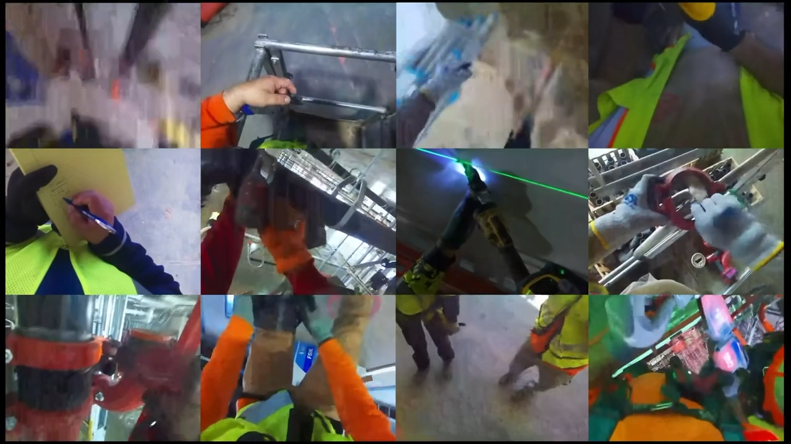

# spatial-ml



[spatial-ml.tech](spatial-ml.tech)

AI is still largely disconnected from the 3D world it’s trying to understand. Models can form stronger connections between objects when given visual context—first images, then video (sequences of images). We introduce a new method for object tracking that emphasizes permanence and distance, and we expand construction-domain video data to support quantitative 3D spatial reasoning—capturing distances, object relationships, and depth in outdoor construction environments.

At each moment, we track objects alongside their evolving relationships, potentially within a large, dynamically balanced graph structure that supports efficient updates, retrieval, and deletion over time. These representations are continuously reinforced and refined during inference time, especially when users provide corrections.

---

## how to run

backend:
`pip install -r requirements.txt`
`uvicorn api.main:app --reload`

frontend:
`cd frontend && cp .env.local.example .env.local`
`npm run dev`

kill all processes:
`lsof -ti :8000 | xargs kill -9; lsof -ti :3000 | xargs kill -9; lsof -ti :3001 | xargs kill -9`

### upload frames to HuggingFace (one-time, required before finetuning)

```bash
python3 -c "
from huggingface_hub import HfApi
api = HfApi(token='YOUR_HF_TOKEN')
api.upload_large_folder(
    repo_id='elizqiu/spatial-ml',
    repo_type='dataset',
    folder_path='data',
    allow_patterns='frames/**',
)
print('Done')
"
```

Then open `finetune.ipynb` in Google Colab (H100 runtime) and run all cells.

---

## summary

Most vision-language models treat images as `(image, caption)` pairs. SpatialVLM goes further — it builds object-centric 3D point clouds, canonicalizes a gravity-aligned Z-axis using flat surface detection, and generates billions of quantitative + qualitative VQA examples for spatial grounding.

This project finetunes on top of the SpatialVLM dataset and adds a small set of construction-specific videos to adapt the model to do the following in a construction context (equipment, workers, sites, object tracking):

- **Quantitative spatial estimation** — how far objects are apart
- **Object relationship tracking** — persistent scene graph of objects, distances, and spatial relations across time
- **3D permanence** — objects that leave frame are not forgotten
- **User-correctable** — corrections to the scene graph reinforce and update the model over time

---

## stack and data sources

- **SpatialVLM**: base spatial model (finetuned)
- **K2-Think-V2** (on K2-V2): CoT reasoning layer
- **Google Gemma**: might use this extra LLM
- **Backboard**: unified memory API for persistent context
- **.tech**: for domains

- SpatialVLM synthetic dataset: 2B VQA pairs on 10M images
- construction finetuning data: small set of outdoor construction videos (frames extracted as images)
- Annotate via expert models each frame with:
  - Object segmentation masks
  - Metric depth estimates
  - Object-centric captions
  - Flat surface candidates (ground, slabs, formwork) for Z-axis canonicalization
- LLM-generated QA pairs emphasizing safety-relevant spatial queries

### pipeline (per video)

```
Video → Extract frames → CLIP filter
                              ↓
                    Expert models (depth, segmentation)
                              ↓
                    Lift 2D pixels → 3D point cloud
                              ↓
                    Detect flat surface → canonicalize Z-axis
                              ↓
                    Object-centric captions + 3D bboxes
                              ↓
                    LLM → quantitative + qualitative QA pairs
```

---

## scene graph

At every timestep, the model maintains a persistent scene graph:

- **Nodes** — detected objects (worker, crane, excavator, rebar stack, trench...)
- **Edges** — spatial relationships (distance, occlusion, proximity, above/below)
- **Properties** — depth estimate, confidence, last-seen timestamp, bounding box

The graph is designed for fast update, retrieval, and deletion across time. When objects leave frame they are retained with a `last_seen` timestamp and re-identified on return.

**User corrections** update graph nodes directly and are logged as additional training signal for future reinforcement.

---

## training

| Platform | Use |
|---|---|
| **Vultr** | GPU cloud for full finetuning runs |
| **Google Colab** | Rapid iteration, dataset prep, evaluation |

### finetuning (following the PaLM-E-2 approach)

1. Load pretrained SpatialVLM weights
2. Freeze image encoder; train on SpatialVLM data mixture + construction VQA pairs
3. Unfreeze image encoder; short finetuning pass on construction data only
4. Evaluate on spatial VQA benchmarks (binary predicate, quantitative estimation)

---

## inference

- Input: video stream or image sequence
- Output per frame:
  - Updated scene graph (JSON)
  - Spatial CoT reasoning trace
  - Quantitative estimates (distances, relative positions)
- Memory: Backboard API stores and retrieves scene graph state across sessions

---

## Benchmarks (target)

- Binary spatial predicate accuracy
- Quantitative distance estimation error (mean absolute error in meters)
- Object re-identification rate across occlusion
- Scene graph consistency across frames

---

## Project Structure

```
spatial-ml/
├── data/
│   ├── raw_videos/           # source construction footage (gitignored)
│   ├── frames/               # extracted + CLIP-filtered frames
│   ├── annotations/          # per-frame depth.npy, masks.json, caption.txt
│   ├── vqa_pairs/            # LLM-generated QA pairs (JSON per frame)
│   └── eval/                 # evaluation splits (binary, quantitative, reid)
│
├── pipeline/
│   ├── extract_frames.py     # video → frames at target FPS, CLIP filter
│   ├── expert_annotation.py  # DepthPro + Florence-2 + SAM2 annotation
│   ├── pointcloud.py         # 2D → 3D lifting, RANSAC Z-canonicalization
│   └── generate_qa.py        # Claude-powered VQA pair generation
│
├── model/
│   ├── finetune.py           # 2-stage LoRA finetuning (SpatialVLM base)
│   └── scene_graph.py        # temporal object graph with re-ID + safety alerts
│
├── inference/
│   ├── run.py                # single-frame inference engine
│   └── correction_loop.py    # user correction → graph update + training log
│
├── eval/
│   └── benchmark.py          # binary predicate, distance MAE, re-ID, consistency
│
├── api/
│   └── main.py               # FastAPI — /infer, /graph, /correct endpoints
│
├── frontend/
│   ├── app/                  # Next.js 16 app router
│   ├── components/
│   │   ├── UploadZone.tsx
│   │   ├── QuestionBar.tsx
│   │   ├── InferenceOutput.tsx
│   │   └── SceneGraphPanel.tsx  # interactive React Flow graph
│   └── lib/
│       ├── api.ts
│       └── types.ts
│
├── VQASynth/                 # cloned — provides depth, localization, scene fusion
├── requirements.txt
└── README.md
```

### end-to-end pipeline

```
data/raw_videos/*.mp4
  → pipeline/extract_frames.py      → data/frames/
  → pipeline/expert_annotation.py   → data/annotations/  (depth, masks, caption)
  → pipeline/generate_qa.py         → data/vqa_pairs/
  → model/finetune.py               → checkpoints/spatialvlm-construction/
  → inference/run.py  +  api/main.py  →  frontend
```

---

## citations

- [SpatialVLM: Endowing Vision-Language Models with Spatial Reasoning Capabilities](https://arxiv.org/pdf/2401.12168)
- [SpatialVLM community implmentation](https://github.com/remyxai/VQASynth)
- [K2-V2: A 360-Open, Reasoning-Enhanced LLM](https://arxiv.org/pdf/2512.06201)
- [Backboard API](https://backboard.io/)
- [PaLM-E: An Embodied Multimodal Language Model](https://arxiv.org/pdf/2303.03378)